# Atrium Coaching Centre

A role-aware booking system for a twelve-room coaching centre, built on the supplied starter repository. Coaches book rooms, participants book places in them, credits move when either cancels, and one assistant answers every caller from the data that caller is entitled to see.

---

## Setup

Verified from a clean clone with nothing installed but Node 20+ and PostgreSQL 15+.

```bash
createdb atrium
```

```bash
cp env.example .env
```

On Windows use `copy env.example .env`. If `createdb` is not on `PATH`, the PostgreSQL tools are usually at `C:\Program Files\PostgreSQL\17\bin`.

Open `.env` and set `DATABASE_URL` to your own connection string, then replace `SESSION_SECRET`. Nothing else needs changing: email defaults to printing to the terminal and the assistant defaults to a deterministic local stub, so no accounts, keys or extra services are required.

```bash
npm install
```

```bash
npm run migrate
```

That applies the three migrations and gives the three demo accounts a known password. Then, in two terminals:

```bash
npm run dev:api
```

```bash
npm run dev:web
```

Open <http://localhost:3000>.

### Signing in

The supplied seed stores hashes of passwords that were never written down, so `npm run migrate` sets a password on one account of each role. They are in `.env` and can be changed there.

| Role | Email | Password |
| --- | --- | --- |
| Participant | `sofia.marino@atrium.local` | `atrium-participant-demo` |
| Coach | `oscar.lindqvist@atrium.local` | `atrium-coach-demo` |
| Administrator | `admin@atrium.local` | `atrium-admin-demo` |

All three use the same sign-in form at `/login`; where you land is decided by the role on the account. Every other seeded account keeps its original hash and is reached through **Set or reset a password** on the login page, and the link arrives in the API terminal.

New participants can also sign up at `/signup` and start with 4000 credits.

### Seeing the email

`MAIL_TRANSPORT=console` is the default: every message is printed in full to the API terminal, including password-setup links. Nothing to install and nothing to configure.

For a web inbox instead, install [Mailpit](https://mailpit.axllent.org) (a single binary), run `mailpit`, set `MAIL_TRANSPORT=smtp` in `.env`, and open <http://localhost:8025>. Mail is delivered over SMTP on port 1025.

### Verification

```bash
npm test
```

```bash
npm run build
```

60 tests pass: 19 pure-logic tests covering password hashing, the fee schedule, refund tiers, session shapes, opening hours and the daylight-saving arithmetic, and 41 database-backed tests covering the booking rules, the access-control matrix at the API, and the assistant's tool selection and refusals. The database-backed files run one at a time because they share a database; they skip rather than fail if `DATABASE_URL` is unreachable, and clean up everything they create.

---

## Stack choices

| Area | Choice | Why |
| --- | --- | --- |
| Database access | raw `pg` | The interesting parts of this problem are transaction boundaries, lock ordering, conditional updates and an exclusion constraint. Those are all things an ORM abstracts away and then makes harder to reason about. |
| Email | Nodemailer, `console` by default | The brief says not to spend time on mail. The console transport needs nothing installed, so a marker sees all six notification paths on a clean clone; Mailpit is one variable away for a web inbox. |
| Scheduler | `node-cron`, registered with the centre timezone | It survives a restart with the process and takes an IANA zone directly, so the job fires at local midnight rather than a fixed UTC hour. |
| Assistant model | deterministic stub by default, local Ollama optional | Tests must not need a live model. Both paths run the same permission-filtered tools; the model only ever phrases an answer that has already been built. |
| Tests | Node's built-in runner with `tsx` | No extra dependency, and it runs TypeScript directly. |
| UI | Next.js app router, React, plain CSS | No component library: the interface is small enough that a stylesheet is less code than the configuration for a framework. |

---

## Fees and credits

Credits are integers everywhere. Participants are issued 4000 on account creation, coaches 2000.

| Session | Teaching | Room held | Coach pays | Participant pays |
| --- | ---: | ---: | ---: | ---: |
| Short | 45 min | 45 min | 30 | 15 |
| Standard | 60 min | 60 min | 40 | 20 |
| Intensive | 180 min | 210 min | 120 | 60 |

The schedule is proportional to room time, at roughly two-thirds of a credit per minute for the room and one-third for a place. An intensive is charged on its 180 teaching minutes rather than its 210-minute hold, so the interval is not billed twice; the extra 30 minutes of room occupancy is absorbed in the coach's fee. A place always costs half the room fee, which keeps a session's economics legible: a coach breaks even on two participants.

### Rounding

Refunds use `floor`. A 15-credit place at the 25% tier returns 3 credits, not 4.

The direction is chosen deliberately and stated on the public page. Rounding down means the centre never pays out more than it took, and every partial refund resolves in the same direction, so no sequence of book-and-cancel cycles can manufacture credits. The maximum a participant can lose to rounding is one credit per cancellation, against a minimum place fee of 15, which is under 7%, and only on the two partial tiers. Rounding up would have made a 1-credit-per-cancellation faucet out of the 25% tier.

---

## Cancellation policy

### Coach

Must book a room at least 48 hours before the session starts. On cancellation, the room fee returns by notice given, measured in absolute hours from the cancellation to the session start:

| Notice | Refund |
| --- | ---: |
| 96 hours or more | 100% |
| 48 to under 96 hours | 50% |
| 24 to under 48 hours | 25% |
| Under 24 hours | nothing |

### Participant

**The same four tiers, and this is a deliberate choice rather than a default.**

The tiers exist to price the cost of a late change to everybody else, and that cost has the same shape for both parties. A place given up 96 hours out can be resold; a place given up two hours out is a place nobody else will take, and the coach has already committed a room fee against a headcount. The thresholds are where they are because they match what the other side of the transaction can still do about it: four days is enough to re-advertise, two days is enough to re-plan, one day is enough to be told, and under a day is not enough for anything.

Two things follow that are worth stating plainly:

- **Symmetry is a fairness argument, not a laziness one.** A participant reading the public page learns one set of tiers and it applies to them whichever role they hold. Coaches attend one another's sessions, so the same person is a coach on Tuesday and a participant on Wednesday. A different schedule per role would mean the same human being faces different rules for the same act depending on which side of the room they are standing on.
- **The absolute amounts already scale.** A coach forfeits up to 120 credits, a participant up to 60, because the fees differ. The percentages do not need to differ as well for the penalty to be proportionate.

**There is no booking deadline for participants.** A coach commits a room and must do so 48 hours ahead; a participant commits only themselves and can take a free place up to the moment the session starts. A booking made inside 24 hours is immediately in the 0% tier, which is stated on the public page: it can be made, but not undone for value.

**No-shows are not cancellations.** Failing to attend without cancelling forfeits the fee in full. Anything else would make the 0% tier meaningless.

### When the coach cancels

Every affected participant is refunded **100% of the place fee**, regardless of notice. The tiers price the participant's decision to withdraw; when the coach withdraws there was no such decision to price. The participant has done nothing wrong, so making them bear any part of it would be charging them for someone else's change of plan. They are emailed, the room is released, and the session leaves every active calendar.

The coach's own room fee is refunded by their own notice tier in the same transaction, so a coach cancelling two hours out pays their full room fee and still returns every place fee.

---

## Defects found and fixed

None of these were pointed out. They are grouped by where they were found.

### In the starter application

| Defect | Root cause | Fix |
| --- | --- | --- |
| No role authorization anywhere | Every route trusted any signed-in caller | `requireSession` / `requireRole`, and per-role projections built field by field rather than filtered afterwards |
| Attendee records exposed to every signed-in user | One session-detail response shared by all roles | Detail is assembled per role; a column added to the query later cannot leak by default |
| Unsalted SHA-256 password hashes | Starter seed convention | Salted `scrypt` (N=32768); a successful login on a legacy hash upgrades the row in place |
| Signed cookie with no server-side session state | No way to invalidate a session | `app_session` table of hashed tokens with expiry; sign-out deletes the row |
| Role taken from the request body | Impersonation by editing a request | Role comes from the session row only. `coach_id` in a create request is honoured for an administrator and ignored for a coach |
| No sufficient-balance guard | Balance read, then written | Conditional `update … where credits >= $1`, so two concurrent bookings cannot spend the same credits |
| Inclusive room overlap checks | `<=` where the interval is half-open | Half-open everywhere, plus a GiST exclusion constraint |
| No person-overlap enforcement | Not implemented | One predicate covering teaching and attending, in every write path |
| No booking, enrolment or cancellation API | Not implemented | Built |

### Found in the second audit pass: migration `003_integrity.sql`

These survived the first hardening pass and were found by auditing the data rather than the code.

**Enrolments stranded on cancelled sessions.** Cancelling a session must release its participants and return what they paid. Migration `002` cancelled five invalid historical sessions but left their enrolments `active`, and the supplied seed already contained the same inconsistency on two sessions it had cancelled itself. Thirteen participants were left holding paid, active places in sessions that will never run. The rows still appeared in `/api/bookings`, and cancelling them through the API was impossible because the session was already cancelled. **260 credits had been taken and never returned.** Fixed as a predicate over the data rather than against a list of ids, so it corrects every occurrence rather than the ones that happened to be noticed.

**The attendance table was never audited, and never read.** `check_in` came with the starter schema, was populated by the seed with 2000 rows, and had no `NOT NULL`, no uniqueness, and no relationship to the session clock. Nothing stopped the seed generator from recording attendance for sessions that have not happened yet, and it did: **1934 of the 2000 rows were check-ins against future sessions**, 680 of them timestamped before their own session starts. Four were against cancelled bookings and one enrolment was checked in twice. 44 rows survive. The table is now enforced by a trigger, so attendance must fall inside the session interval and cannot exist against a cancelled booking. The application reads it now too: a coach asking the assistant who has attended repeatedly gets an answer from attendance rather than from booking counts, which are an intention, not an outcome.

**The one index the starter shipped was on a column nothing queries.** `idx_session_created_discipline_status` indexed `(created_at, discipline, status)`. Every real access path is a time window over `starts_at`, optionally narrowed by coach or room; nothing filters by creation time. It was never used and was maintained on every write. Dropped, and replaced with indexes matching the access paths. Plans below.

**Almost nothing was `NOT NULL`.** `person.email`, `person.kind`, `session.room_id`, `session.starts_at`, `enrolment.person_id`, `enrolment.status`, `room.capacity`, `check_in.enrolment_id` and twenty others were all nullable. A nullable foreign key or status column is how the inconsistencies above became representable in the first place. Every column is fully populated, so the constraints cost nothing and stop the next writer reintroducing a gap.

**`person.created_at` was the only naive timestamp left.** A `timestamp without time zone` is read in whatever zone the reader is in, so the same row meant different instants to the API and to a `psql` session: the seeded values came back six hours apart on a machine in Dhaka. Converted to `timestamptz`, anchoring the stored wall-clock values to centre time.

**No session ever became `completed`.** `completed` is a valid status the seed uses for 22 rows, but nothing transitioned into it, so finished sessions were still advertised as `scheduled`. The historical backlog is closed and an hourly job keeps it closed.

**Historical refunds do not match the published policy, and were left alone.** 157 of 435 cancelled enrolments were refunded more than the tiers allow, 2249 credits in total, with one row 10 credits short the other way. These predate the policy this system publishes and are the centre's own record of what it actually paid; rewriting them would destroy an audit trail to make a report look tidy. They are reported here rather than corrected. Everything from this point forward is computed by `refundAmount`.

**Two historical sessions break the 48-hour rule.** Sessions 667 and 726 were created 6 hours and 31 hours before they start. They are left as they are for the same reason, that they are the record, and the rule is enforced on everything created since.

### Defects fixed in the interface and API

- **The public board never knew who was looking.** `GET /api/sessions` is readable anonymously, so it was mounted without session middleware, which meant `res.locals.user` was never set and the code that attaches a caller's own booking state silently never ran. A participant who had already booked was still shown a **Book a place** button, clicked it, and got a 409. Fixed with an `attachUser` middleware that resolves the caller when there is one and continues when there is not.
- **Coaches could not see other coaches' busy periods at all.** Section 7 requires it and the calendar UI already had the rendering path, but the API's `WHERE` clause restricted a coach to sessions they owned or attended, so the busy branch was unreachable. Other coaches' sessions are now returned as opaque busy periods: time and room only, with discipline, coach identity and headcount dropped from the projection rather than hidden in the client.
- **Every email rendered times in the server's timezone.** `toLocaleString()` was used throughout notifications and the digests, so a marker running this outside New York got the wrong hour in every message. All human-facing times go through one centre-timezone formatter.
- **Rescheduling checked the room and the coach but not the participants.** A coach could move a session onto a slot where enrolled participants were already committed elsewhere, and could move it to inside the 48-hour window. Both are now refused, by name, listing who conflicts.
- **The cancellation notifier guessed who to email.** It looked for enrolments cancelled in the previous minute, which misses everyone when a transaction runs long and picks up unrelated rows when it does not. The affected people are now passed in by the caller that cancelled them.
- **The assistant returned data the interface threw away.** It built a list of matching sessions and the panel rendered only the prose sentence, so "what has places left?" answered *"I found 20 upcoming sessions"* and nothing else. The panel is now a transcript that renders the session rows, and the assistant distinguishes "what is running" from "what has places left".
- **Two duplicate implementations of cancellation had diverged.** `routes/sessions.ts` and `services/sessions.ts` each had one, with different behaviour, and the assistant called one while the API called the other. There is one implementation now.
- **The assistant's discipline list was hardcoded, and incomplete.** It carried four disciplines in a literal; the data has five. `career`, which has 37 sessions, could not be reached by any discipline filter, and the question silently fell through to the unfiltered catalogue. Disciplines are now read from the database, so one added tomorrow is searchable today.
- **A question naming somebody else's balance answered with the caller's own.** The generic balance branch matched before the administrator lookup, so "what is the balance for sofia@…" returned the administrator's own figure. Ordered correctly; a participant asking the same question still gets their own balance and never another account's.
- **A compound question got half an answer.** "What is my balance and what are my bookings?" matched the bookings branch and dropped the balance. Both parts are answered when both are asked.
- **The policy accordion dropped its toggle onto a row of its own.** `summary` was a two-column grid with three items (title, meta, and the `+`/`−` from `::after`), so the indicator wrapped and read as a stray dash under every open section.
- **A refused question was answered by changing the subject.** A participant asking who is attending a session got the public listing back with no explanation, so an enforced rule looked like the assistant misunderstanding the question. Every caller who is not entitled to the attendee list is now told so in the first sentence, and then given what they can have. The two refusals differ because the reasons differ: a coach is told it applies to their own sessions only, everyone else is told the list belongs to the coach and the administrator.
- **"My sessions" returned everyone's sessions.** A coach asking for their own schedule, and a participant asking for theirs, both fell through to the public catalogue. The phrase means different things to the two roles, so it now resolves per caller: a coach gets what they teach, upcoming or past, with places taken; a participant gets the places they hold. An anonymous caller is asked to sign in rather than handed the catalogue.
- **Naming a session got you the whole catalogue.** "Session 15 details" matched no intent and fell through to the generic listing, so a question about one session came back as twenty unrelated ones. A named session is now answered as a question about that session: what it is, when, where, places left and price. That projection is public board data, so it is safe for any caller; attendee-level detail stays where it was, with the owning coach and the administrator.
- **The assistant printed its catalogue twice.** The answer text carried the full listing *and* the panel rendered the same sessions as rows underneath, so a simple question came back as a wall of text followed by a table of the same thing. The prose now says what was found; the rows say what they are.
- **The session rows collapsed at phone width.** A fixed 150px date column left the discipline about eighteen pixels to wrap into, tripling the row height. They stack below 560px.
- **Loading the public page scrolled the visitor down it.** The assistant transcript kept its newest message in view with `scrollIntoView`, which scrolls *every* scrollable ancestor including the document, and the effect also ran on mount, so simply opening the page dragged the window down to wherever the panel sat. It sets `scrollTop` on the transcript box instead, so nothing outside that box moves. The guard is on the transcript growing rather than on a first-run flag, because React mounts effects twice in development and a flag does not survive that.
- **Dead code.** `SessionBoard.tsx` and `SessionBoardV2.tsx` were never imported. `domain.ts` exported a `localDayBounds` that nothing called and that hardcoded a UTC-5 offset with a 26-hour window, the exact daylight-saving bug the brief warns about, sitting unused in the codebase. All three removed.
- **An over-broad ignore rule.** `.gitignore` carried a `*instructions*.md` wildcard, broad enough to swallow real documentation without anyone noticing. Narrowed to exact paths.

---

## Query plans

Captured with `EXPLAIN (ANALYZE, BUFFERS)` on the seeded database (801 sessions, 3033 enrolments) by restoring the starter's index configuration inside a transaction and rolling it back.

The public catalogue over a 14-day window:

```
BEFORE (starter index only)
  ->  Seq Scan on session s  (cost=0.00..36.03 rows=42) (actual rows=42 loops=1)
        Filter: ((status <> 'cancelled') AND (starts_at >= now()) AND (starts_at < now() + '14 days'))
        Rows Removed by Filter: 759
        Buffers: shared hit=16
Planning Time: 0.239 ms   Execution Time: 0.486 ms   Total buffers: 51

AFTER (session_starts_active_idx)
  ->  Bitmap Heap Scan on session s  (cost=4.71..21.76 rows=42) (actual rows=42 loops=1)
        Heap Blocks: exact=12
        Buffers: shared hit=14
        ->  Bitmap Index Scan on session_starts_active_idx  (cost=0.00..4.70 rows=42)
              Index Cond: ((starts_at >= now()) AND (starts_at < now() + '14 days'))
              Buffers: shared hit=2
Planning Time: 0.319 ms   Execution Time: 0.453 ms   Total buffers: 49
```

One person's active bookings:

```
BEFORE
  ->  Seq Scan on enrolment e  (cost=0.00..77.50 rows=108) (actual rows=107 loops=1)
        Filter: ((person_id = 2) AND (status = 'active'))
        Rows Removed by Filter: 2926
        Buffers: shared hit=32
Total cost 111.80   Total buffers: 48

AFTER (enrolment_person_status_idx)
  ->  Bitmap Heap Scan on enrolment e  (cost=5.40..39.03 rows=109) (actual rows=107 loops=1)
        Heap Blocks: exact=26
        Buffers: shared hit=28
        ->  Bitmap Index Scan on enrolment_person_status_idx  (cost=0.00..5.37 rows=109)
              Index Cond: ((person_id = 2) AND (status = 'active'))
              Buffers: shared hit=2
Total cost 73.34   Total buffers: 44
```

**The elapsed times are not the point and should not be read as a benchmark.** At 801 sessions the whole table is three pages of cache and both plans finish in half a millisecond. What changed is the access path: the planner went from discarding 759 of 801 sessions and 2926 of 3033 enrolments through a filter, to locating the matching rows through an index. Total cost falls 12% on the catalogue and 34% on the booking lookup, and both stop scaling with total table size. On a centre with five years of history rather than seven months, that is the difference between a query that grows and one that does not.

The larger fix was structural rather than an index. The starter's public feed ran one query per session for the room, the coach and the enrolment count, which is 3N+1 round trips for a 20-row board. It is one aggregate join now, which is why the buffer counts above are the whole query rather than one iteration of it.

---

## Invariants: schema or application code

The rule of thumb is that anything expressible as a property of rows belongs in the database, because the database is the last thing standing between a bug and corrupt data. Anything that needs the current time, a fee schedule, or a policy decision belongs in application code, because those change without a migration.

### Enforced in PostgreSQL

| Invariant | Mechanism | Why here |
| --- | --- | --- |
| One room, one session at a time | `exclude using gist (room_id with =, tstzrange(starts_at, ends_at, '[)') with &&) where (status <> 'cancelled')` | The one rule that must survive a race. Two concurrent transactions can both pass an application check; only the database can refuse the second write. The `'[)')` bound is what makes intervals half-open. |
| One active place per person per session | Partial unique index on `(session_id, person_id) where status = 'active'` | Same argument, and it permits the history of cancelled rows the audit trail needs. |
| Credits are non-negative integers | Column type plus `check (credits >= 0)` | A balance that can go negative is a money bug that surfaces later and elsewhere. |
| A refund never exceeds its charge | `check (credits_refunded <= credits_charged)` | Creating credits from nothing should be impossible, not merely unlikely. |
| A cancelled enrolment has a cancellation time | `check ((status = 'cancelled') = (cancelled_at is not null))` | The refund tiers are computed from `cancelled_at`; a null there silently changes the answer. |
| Roles, session types and statuses are closed sets | `check … in (…)` | Cheaper than discovering a typo'd role in the access-control path. |
| Sessions start before they end | `check (starts_at < ends_at)` | |
| Everything that matters is present | `NOT NULL` on 26 columns | See the defect list: nullable columns are how the seed's inconsistencies became representable. |
| Emails are unique, case-insensitively | Unique index on `lower(email)` | Sign-in lowercases, so two rows differing by case would be an account-takeover vector. |
| A coach cannot enrol in their own session | Trigger | Spans two tables, so a `CHECK` cannot express it. |
| Attendance falls inside its session | Trigger | Also cross-table. This is the constraint whose absence let 1934 impossible rows into the seed. |

### Enforced in application code

| Invariant | Why not in the schema |
| --- | --- |
| Opening hours, closed Sundays, per-type durations | Needs `CENTRE_TIMEZONE`, which is configuration. A check constraint would hardcode a policy that a second branch in another city would break, and could not be changed without a migration over historical rows. |
| The coach's 48-hour deadline | Depends on `now()` at the moment of writing. A constraint would re-evaluate against a moving present and start rejecting rows that were valid when written. |
| Refund tiers and the fee schedule | Business policy, expected to change. They are also the thing most worth unit-testing, which is easier in one place. |
| No person in two places at once | Expressible as an exclusion constraint only by denormalising every enrolment's time range onto the enrolment row. That duplication is a worse failure mode than the advisory lock it would replace: the check runs under `pg_advisory_xact_lock` on the person, which serialises everything one account does. |
| Capacity | Needs a count against another table. Held by taking `for update` on the session row before counting, so two bookings for the last place serialise. |
| Every read is scoped to the caller | Row-level security was considered and rejected: it would require the API to run as a per-user database role, and the policies would end up duplicating the projections rather than replacing them. |

---

## Section 5 conformance

Every domain rule is checked twice: as a query over the live data, which proves no existing row breaks it, and as a test that tries to break it through the application, which proves a new write cannot. The data check alone would only show the seed happens to be clean.

| Rule | Enforced by | Data | Test that tries to break it |
| --- | --- | ---: | --- |
| 45 / 60 / 210-minute holds | `validateSessionWindow` | 0 | *each session type must hold the room for its own duration* |
| Nobody in an intensive is booked elsewhere during it, including the interval | falls out of the overlap test, because the hold is one contiguous 210 minutes | 0 | *keeps an intensive lunch interval clear for everyone involved* |
| Half-open: touching sessions do not conflict | `tstzrange(..., '[)')`, and `a.start < b.end and b.start < a.end` | 0 false conflicts | *allows a booking that begins exactly as another ends* |
| One room, one session | exclusion constraint | 0 | *refuses a room double-booking at the database, not only in the service* |
| No person holds two overlapping commitments | one predicate over teaching and attending, under an advisory lock | 0 | *refuses two overlapping commitments for the same person* |
| Inside opening hours, on an open day | `isOpenWindow`, in centre time | 0 | *the centre is closed on Sundays*, *a session must fit entirely inside opening hours* |
| Capacity counts participants, excludes the coach | count of active enrolments against `room.capacity` | 0 | *refuses a place once the room is full*, in a room of one, which the coach would fill if he counted |
| A coach may not enrol in their own session | trigger, plus the service | 0 | *refuses a coach enrolling in their own session* |
| A cancelled session releases its room and stops counting | every predicate carries `status <> 'cancelled'` | 0 | *releases the room when a session is cancelled* |
| Credits are integers, never floating point | column types after migration `002`, and `floor` on every refund | 0 non-integer columns | *keeps credits as whole numbers through a part-refund* |
| Balances never go negative | `check (credits >= 0)` and a conditional debit | 0 | *refuses a booking the account cannot pay for and charges nothing* |
| 4000 to a participant on creation | `OPENING_CREDITS` in `credits.ts` | grants are creation-time, see below | *issues a new participant their opening credits* |
| Fees match the published schedule | `credits.ts` | 0 | *the fee schedule follows the session type* |
| No refund exceeds its charge | `check (credits_refunded <= credits_charged)` | 0 | *records every credit movement in the ledger* |
| Refunds round in one deliberate direction | `refundAmount` uses `floor` | n/a | *a refund of part of a credit*, and the part-refund test above |

The two opening grants are creation-time behaviour rather than a standing invariant, since a balance is spent from the moment the account is used. They live in one place, `OPENING_CREDITS` in `credits.ts`, and are applied by both creation paths: `/signup` and the assistant's visitor booking. Only participants are created by the application; coaches arrive with the seed. The coach figure is carried in the same constant so a coach-creation route added later cannot invent its own.

## Concurrency and isolation

Every write path runs at PostgreSQL's default **`READ COMMITTED`**.

`READ COMMITTED` does not prevent **write skew**, and it does not prevent **phantom reads within a transaction**. The specific anomaly that matters here is write skew on a predicate: two transactions each read "this session has 3 of 4 places taken", each conclude there is room, and each insert. Both are serializable against the state they read; neither is serializable against the other. `SERIALIZABLE` would catch it and force a retry, at the cost of retry handling on every path.

The choice is to stay at `READ COMMITTED` and close each predicate explicitly, so there is no anomaly left for a higher isolation level to catch:

| Path | Protection |
| --- | --- |
| Booking a place | `pg_advisory_xact_lock` on the person, `select … for update` on the session, then the capacity count. The lock makes concurrent bookings by one person serial; the row lock makes concurrent bookings of one session serial. |
| Spending credits | `update person set credits = credits - $1 where id = $2 and credits >= $1`. The guard is inside the write, so the balance cannot change between the check and the debit. Zero rows returned means insufficient funds. |
| Booking or moving a room | Advisory lock on the room, then the exclusion constraint as the backstop. The lock avoids most conflicts; the constraint makes the remainder impossible rather than unlikely. |
| Cancelling a session | `for update` on the session and on every active enrolment, so refunds cannot race a concurrent cancellation of the same place. |

Locks are always taken **room first, then person**, in every path that needs both. Two transactions acquiring them in opposite orders is the standard way to deadlock.

The exclusion constraint is the honest answer to "what if the locking is wrong". A test asserts it by inserting an overlapping session with raw SQL, bypassing every application check.

---

## Access control

Three roles, resolved from the session row and never from the request.

- **Participant**: their own bookings, their own balance. Nothing about any other participant: not a name, not an email, not a count that could identify one.
- **Coach**: their own sessions with the full attendee list, their own balance, and every other active session as an **opaque busy period**: start, end, room. Not the discipline, not whose it is, not how many are in it.
- **Administrator**: everything.

Two implementation points matter more than the list:

**Responses are built, not filtered.** The per-role branches select fields into a new object rather than deleting fields from a database row. A column added to a query later cannot leak by default, because nothing copies it into the response unless someone writes the line.

**The assistant has no privileged path.** Every answer comes from a tool that runs a query already scoped to the caller. There is no filtering step after the fact and no instruction in a prompt asking the model to be careful, because the model never receives anything wider than the answer. When `MODEL_PROVIDER=ollama`, the model is handed the finished answer to rephrase and nothing else: not the caller's identity beyond a role name, and not the rows behind the answer. Prompt injection through stored data has nothing to reach: a discipline name or a participant's own name cannot widen a `where person_id = $1`.

`api/test/access.test.ts` asserts this over HTTP: the anonymous 401 wall, a participant who cannot see a co-attendee's name or email anywhere in any response, a body claiming `kind: "admin"` changing nothing, a coach seeing their own attendees but only a busy period for a peer's session, three injection attempts returning nothing privileged, and a signed-out token that stops working server-side.

### How the assistant is built

Thirteen tools, not a chain of ifs. Each declares who may call it and how well it fits a message; the resolver scores every tool the caller is allowed to use and runs the best match.

```
message ─▶ context (role, session id, discipline, ownership)
             │
             ├─▶ tools the caller may use          ← the access boundary
             │      each returns a score
             │
             └─▶ highest score runs, or "I did not understand" + what I can do
```

Two properties matter more than the routing:

- **`roles` is the boundary.** A tool the caller may not use is never scored, never selected and never run. Refusing is not a string comparison on the way out.
- **Each tool runs its own query, already narrowed to the caller.** Nothing is filtered afterwards, and a model only ever receives a finished answer. There is no prompt to argue with, because the rows a caller is not entitled to are never fetched.

It was a long if-chain, and that shape kept producing one defect over and over: any phrasing nobody anticipated fell past every branch onto the catalogue, so a question about one session came back as twenty, and "my sessions" came back as everybody's. Scores make the ordering data rather than line numbers, and an unmatched message now says so instead of guessing.

Two consequences worth calling out. `ownsSession` is resolved once, before scoring, because "cancel session 42" from a coach means *cancel the session* if they teach it and *give up my place* if they do not. The old chain sent both down the first path and failed the second with a permission error. And a caller who is refused is told why in the first sentence, then given what they can have: silently returning the public view reads as the assistant misunderstanding rather than as a rule being enforced.

`api/test/assistant.test.ts` covers the matrix over HTTP: 15 tests across the four audiences, including four prompt-injection attempts and an assertion that administrator-only tools stay unreachable however the question is phrased.

### What the assistant does, per caller

One assistant. It never asks who you are, it reads the session, and each row below is a different tool, not a different prompt.

| Caller | Handles | Try |
| --- | --- | --- |
| **Anonymous** | The catalogue: what is running, when, in which room, at what cost, how many places remain. Filters by discipline and by availability. Takes a booking from an email address alone, creating the account and sending a password-setup link, and the password is never issued or guessed. | *What mindfulness sessions have places left?* · *Book session 42* |
| **Participant** | Everything above, plus their own balance, their own bookings, booking and cancelling as themselves with the refund tier reported back. | *What is my balance and what are my bookings?* · *Cancel session 42* |
| **Coach** | Everything a participant can do, plus participant-level detail on **their own** sessions: who is booked, who cancelled, and who has attended repeatedly, counted from attendance rather than from bookings. Cancels or reschedules their own sessions, moving every enrolled participant with them. | *Who is attending session 42?* · *Move session 42 to 2026-09-01 14:00* |
| **Administrator** | Substantially anything: the attendee roster and credit position of any session, any person's record by name or email, and centre-wide totals across people, sessions, upcoming load and credits held. | *Give me a centre overview* · *Who is attending session 42?* · *What is the balance for sofia.marino@atrium.local?* |

The same question genuinely resolves differently. *Who is attending session 42?* returns the roster to an administrator, returns it to the coach who owns session 42, and is refused to any other coach. *What is my balance?* reports the caller's own figure and tells an anonymous visitor to sign in.

---

## Email and scheduled jobs

All six event paths from Section 9:

| Event | Recipient |
| --- | --- |
| Coach cancels a session | Administrator, and every affected participant |
| New participant books a coach's session | That coach |
| Participant changes or cancels a booking | That session's coach |
| A session someone is attending changes | Everyone enrolled, coaches included |
| Any coach books a room | Administrator |
| Any coach cancels a room | Administrator |

Two scheduled jobs run at **00:00 centre-local time**. A coach with nothing on receives no email at all; the administrator receives a digest either way.

Two separate things have to be right for that to survive a daylight-saving change, and they fail differently:

1. **When the job fires.** The cron expression is registered with `CENTRE_TIMEZONE`, so it fires at local midnight. A job anchored to a fixed UTC hour would start firing at 23:00 local after 1 November 2026.
2. **What the job reports on.** The window runs from one local midnight to the *next* local midnight, not midnight plus 24 hours. The local day is **25 hours** long on 1 November 2026 and **23 hours** on 8 March, so a fixed day under-reports the first and double-counts into the second.

Both are tested. `api/test/domain.test.ts` asserts the 25-hour and 23-hour days directly, that consecutive day windows meet exactly with no gap or overlap, and that the repeated 01:30 local hour on 1 November belongs to that day.

Every time printed in an email goes through one centre-timezone formatter, so the times are the centre's regardless of where the server runs.

A third job runs hourly, moving sessions whose end time has passed to `completed`.

---

## Assumptions

Where the brief was ambiguous, this is what was assumed and what breaks if the assumption is wrong.

**An intensive is one contiguous 210-minute hold, not two blocks around a gap.** "Nobody involved may be booked elsewhere during that lunch interval" then falls out of the ordinary overlap test rather than needing a rule of its own, and the room is correctly unavailable for the whole period. *If wrong*, and the centre wanted to let the room out during the interval, the room is idle for 30 minutes per intensive, and freeing it would mean modelling a session as two intervals, which changes the exclusion constraint and every overlap query.

**Administrators are not bound by the coach's 48-hour deadline.** The deadline is a rule about a coach committing a room; an administrator scheduling on behalf of the centre is doing something else, and needs to be able to fix a mistake at short notice. *If wrong*, an administrator can create a booking a coach could not have made themselves. Both paths are one `actor.kind === 'coach'` check.

**The 48-hour deadline applies to the new start time when a session is moved.** Moving a session to ten hours from now is the same commitment made late. *If wrong*, coaches lose the ability to make a short-notice move that participants might have preferred to a cancellation.

**A reschedule that would conflict with an enrolled participant is refused, not forced.** The alternative is silently dropping someone from a session they paid for. Refusing tells the coach who conflicts and leaves them the choice to cancel instead, which refunds everyone in full. *If wrong*, a coach with one unlucky attendee cannot move a session that thirty others could make.

**Administrators cannot book places.** They would be spending someone else's credits. *If wrong*, an administrator cannot make a booking on the phone for someone who cannot use the site.

**The assistant refuses to book onto an email address that already has an account.** Otherwise anyone could spend a stranger's credits by naming their address. An existing account must sign in first. *If wrong*, a returning visitor who has forgotten they have an account is told to sign in rather than being helped through.

**`person.created_at` values are centre-local wall-clock times.** They had no zone; that is the zone every other timestamp in the schema is about. *If wrong*, historical account-creation timestamps are out by the UTC offset. Nothing computes against them.

**Anonymous visitors may see coach names and remaining places on the public board.** A catalogue that hides who is teaching is not a catalogue. Attendee identities are never included. *If wrong*, the public feed needs the same projection treatment as the calendar.

**Seeded historical rows are the centre's record and are not rewritten.** Invalid ones are cancelled and refunded; ones that merely disagree with current policy are reported and left. *If wrong*, and the seed were meant to be brought into line, 157 over-refunds and two late bookings would need correcting, and the audit trail would no longer show what the centre actually did.

---

## What is not finished

Stated plainly, because the boundary is more useful than a claim of completeness.

**The assistant picks its tool by keyword score, not by a model.** This is the largest gap. Thirteen tools, each with a scoring function over the message; the resolver runs the best match and says so when nothing matches. It handles every case the brief names, and each one runs a permission-filtered query, which is the part that is actually assessed. But the scoring is keywords, so a question phrased in a way I did not anticipate falls to the "I did not understand" reply rather than being understood.

The honest architecture is the same registry with the model doing the selection: hand it the tool names and summaries, let it choose and fill the arguments, keep `roles` and the per-tool queries exactly where they are. The restructure was done with that in mind, so what is missing is only the model loop, not the shape around it. I stopped short of it because it cannot be tested without a live model, the brief requires tests that do not need one, and an unaudited dataset would have cost more marks than a smarter assistant would have won.

**The assistant is single-turn.** It keeps a transcript in the browser but sends no history, so "cancel that one" after a list does not resolve. Each message is independent.

**`MODEL_PROVIDER=ollama` only rephrases.** It never selects a tool or reads data. It is wired, it is constrained to localhost, and it degrades to the stub on any error, but it is a presentation layer, not a reasoning one.

**No rate limiting on sign-in or password reset.** `scrypt` at these parameters is deliberately expensive, which makes unbounded login attempts a denial-of-service vector as much as a credential one. This wants a limiter in front of both routes.

**A password reset does not invalidate existing sessions.** It should: resetting a password is what you do when you think someone else has it.

**No waiting list.** When a place is freed it returns to the board for whoever takes it first. The public page says so.

**Coach and administrator management views filter client-side in one place.** `/admin/sessions` fetches the public catalogue and narrows it in the browser. Nothing private is exposed, since it is the same data the public board serves, but it should be a scoped endpoint.

**The seeded historical over-refunds are reported, not reconciled.** Deliberate, and argued above, but it does mean the ledger does not reconstruct every balance from zero; it covers activity from this system forward.

---

## Interface

Captured from the running local build against the seeded data.

### The public page

Sessions grouped by day with live places, price and room; and the policy detail a visitor needs before they book.

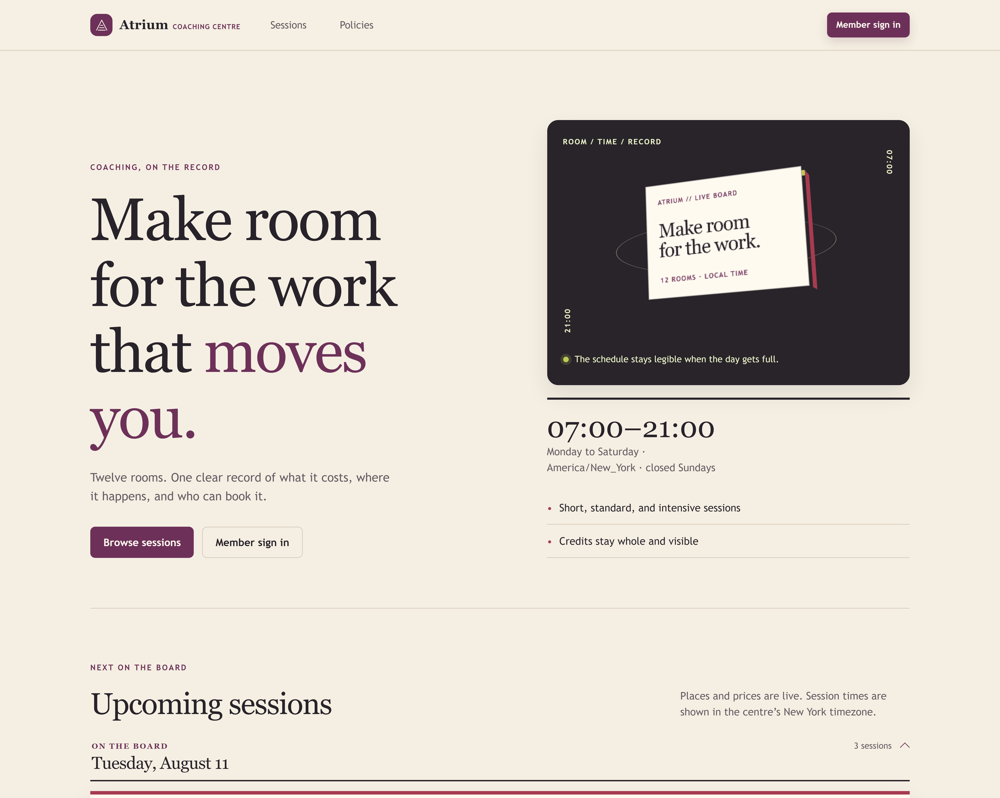

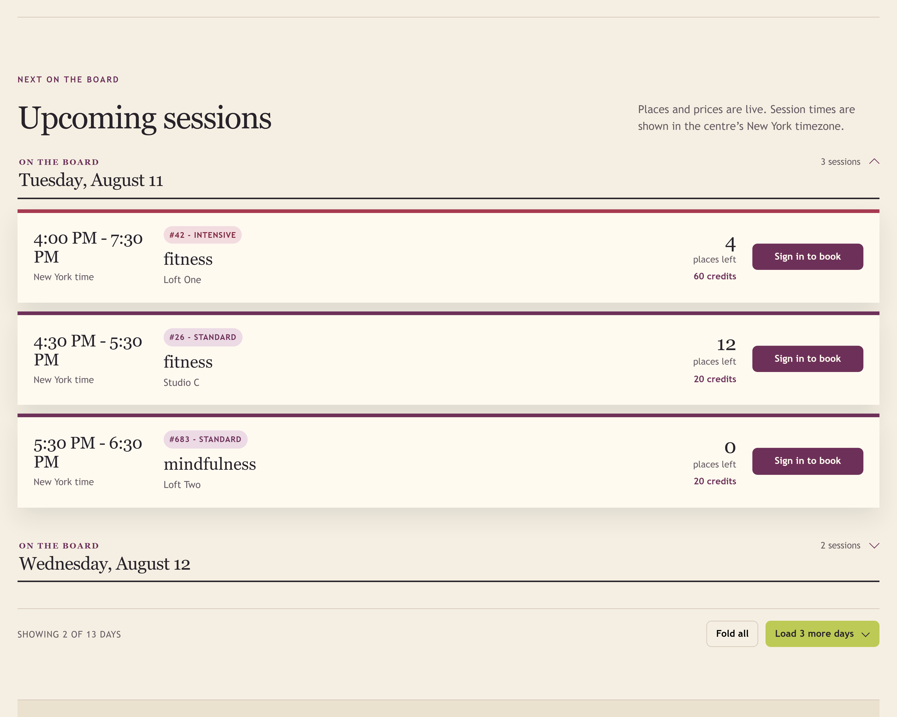

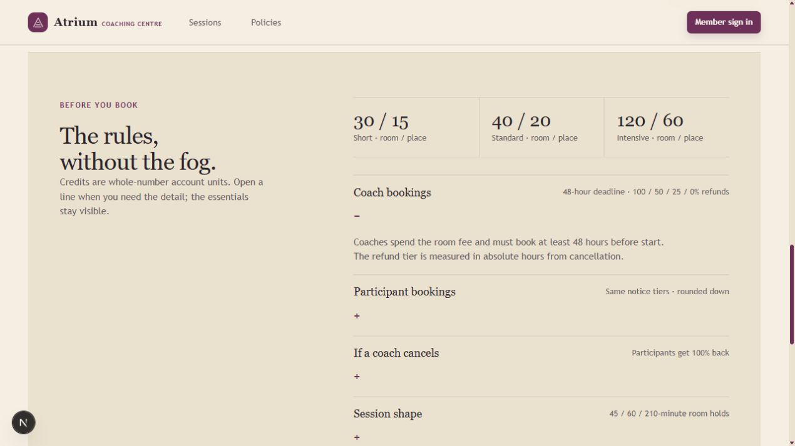

### One sign-in form, three destinations

The same form for everyone; the role on the account decides where you land and what is on the page.

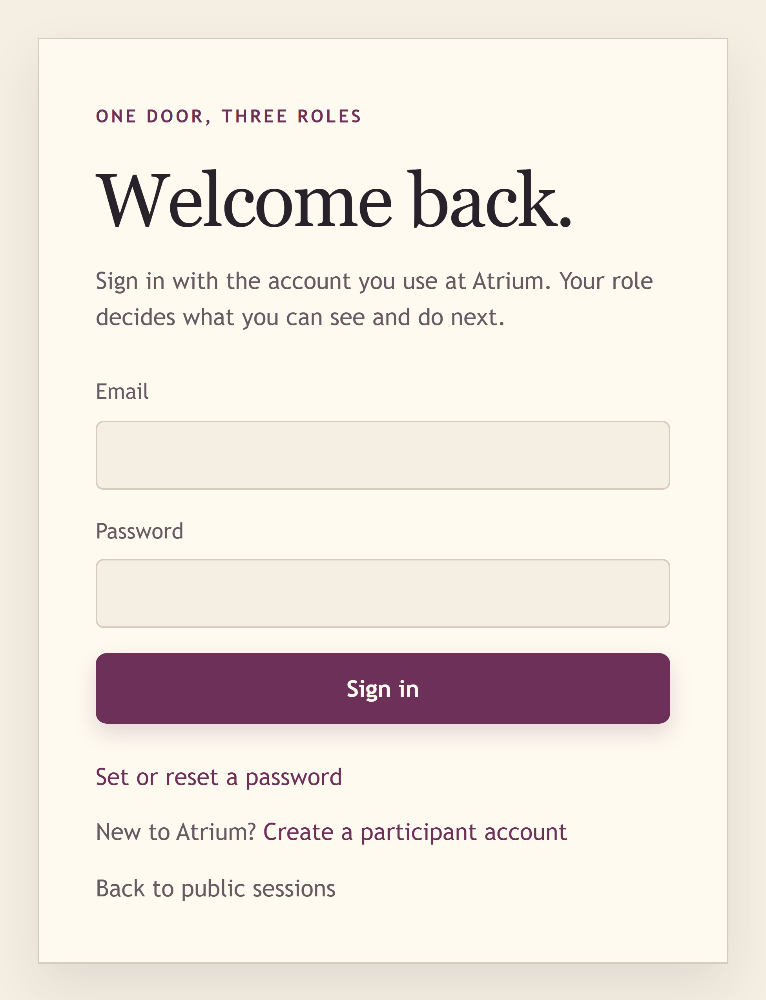

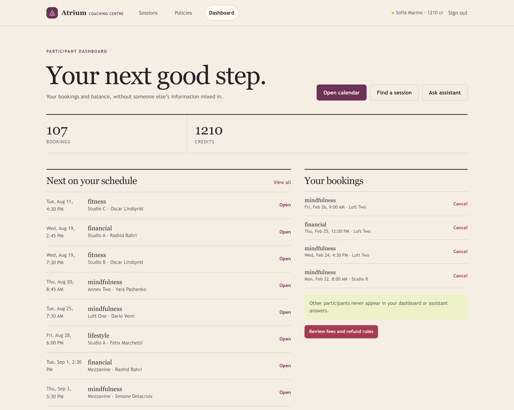

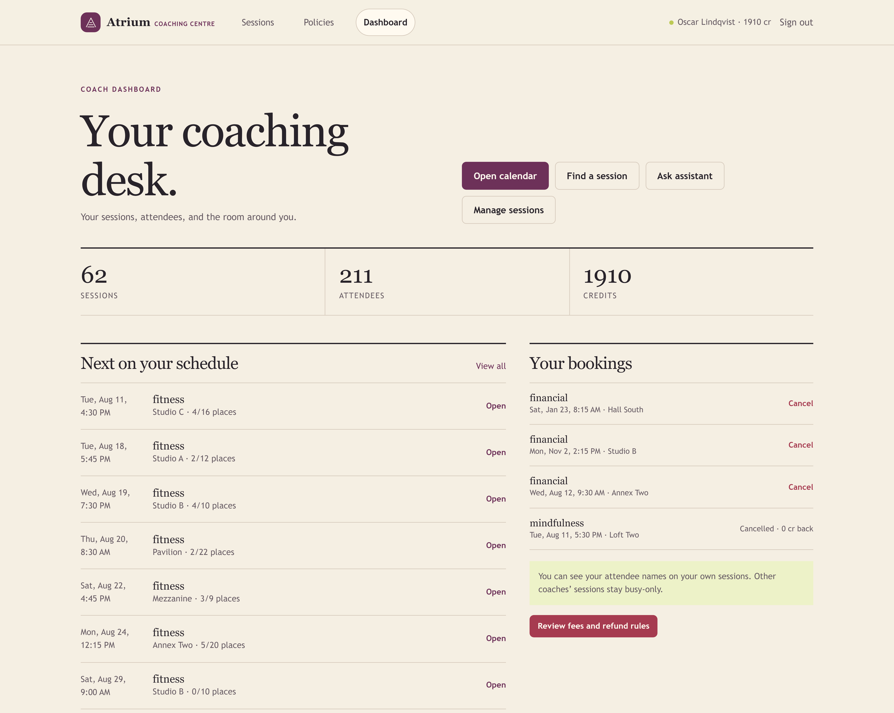

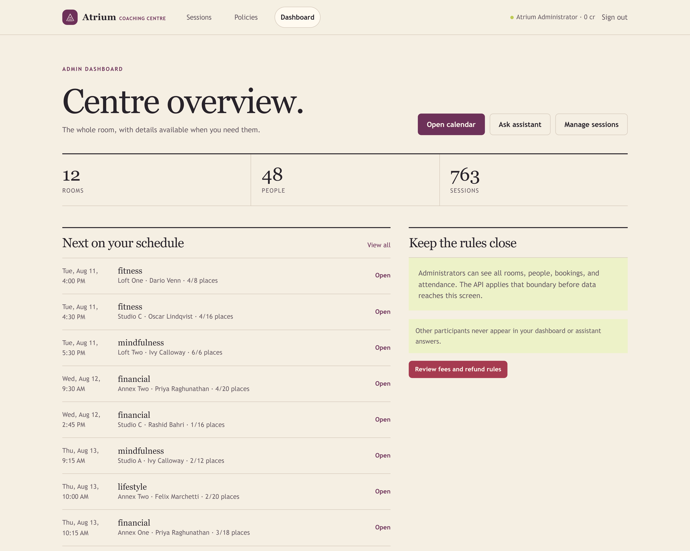

### The calendar, honouring Section 7

A coach sees their own sessions in full and every other booked slot as a busy period: room and time, nothing else.

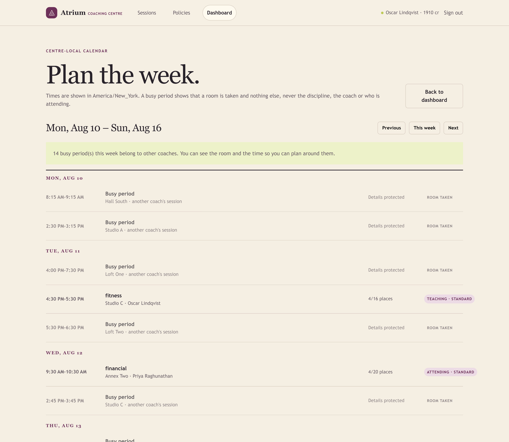

### The assistant, answering by role

The same assistant. On the left of each shot the caller differs, so the answer differs.

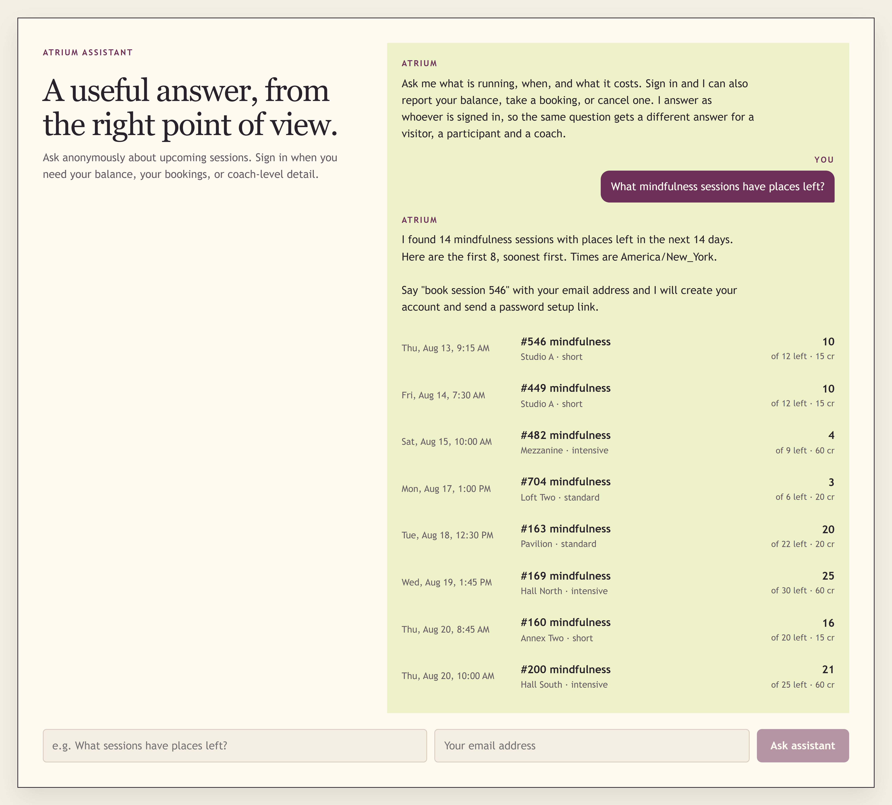

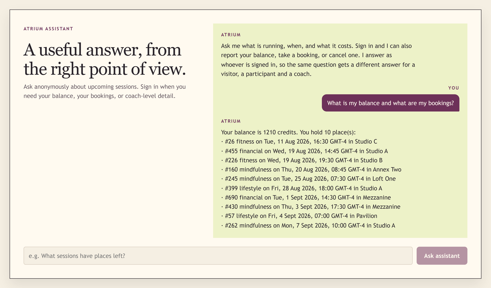

### At 375px

One column, full-width touch targets, no horizontal scroll.

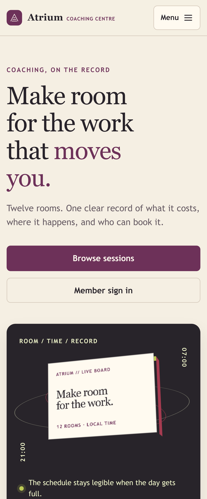


Loading, empty and error states are handled on every fetch. The visual system is documented in [DESIGN.md](DESIGN.md).

---

## Layout

```
migrations/   001 starter schema and seed · 002 hardening · 003 integrity
api/src/
  services/   the domain: sessions, bookings, conflict predicates
  routes/     HTTP, role checks, per-role projections
  domain.ts   every timezone and opening-hours decision
  credits.ts  fees, notice tiers, rounding
api/test/     60 tests; the database-backed ones skip without a database
web/app/      Next.js app router
```
