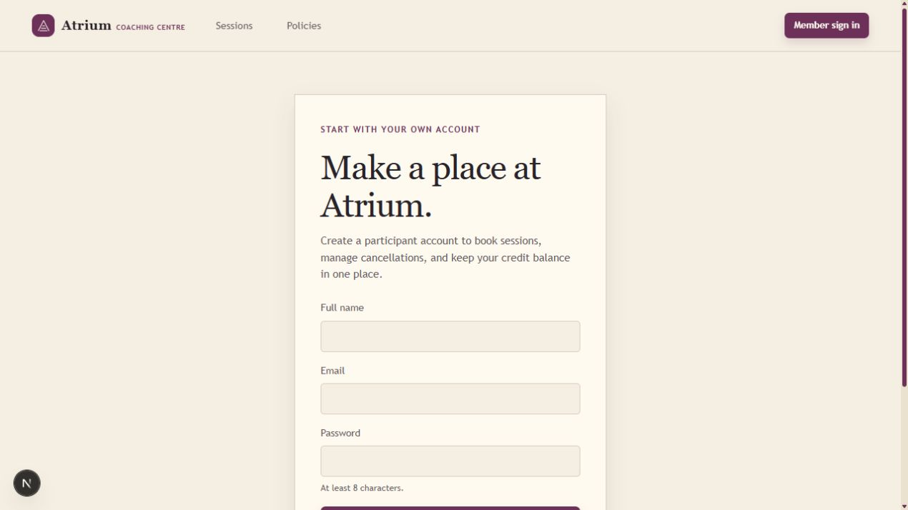

# Atrium Coaching Centre

Atrium is a role-aware coaching-centre booking system built on the supplied starter repository. It keeps the centre’s twelve rooms, credits, historical seed data, public session board, unified login, calendars, assistant, notifications, and local scheduler in one application.

## Stack choices

- API: Node 20+, Express, TypeScript, raw `pg` for explicit transaction and query-plan control.
- Web: Next.js 16, React, TypeScript.
- Passwords: Node `scryptSync` with random salts; legacy SHA-256 seed hashes are upgraded after a successful login.
- Mail: Nodemailer. `MAIL_TRANSPORT=console` is the deterministic local default; SMTP can point to Mailpit on port 1025.
- Scheduler: `node-cron`, scheduled with `CENTRE_TIMEZONE` rather than a fixed UTC hour.
- Assistant: deterministic permission-filtered stub by default. It can catalogue sessions, book/cancel places, report personal balance, show coach-owned attendee detail, and let a coach move or cancel their own session. An optional local Ollama adapter is available when `MODEL_PROVIDER=ollama`; it accepts only localhost model endpoints and receives only already-filtered context.
- Tests: Node’s built-in test runner with `tsx`.
- UI: semantic React/Next components and custom CSS. The visual system uses poster-stock paper, graphite ink, plum hierarchy, citron availability marks, and poppy warnings; blue is intentionally absent from the palette.

## Setup

1. Install PostgreSQL 15+ and Node 20+.
2. Create a database and configure the connection:

```bash
createdb atrium
copy env.example .env
```

Set `DATABASE_URL` and replace `SESSION_SECRET`. For a local run without Mailpit or another SMTP server, set `MAIL_TRANSPORT=console` in `.env`; the provided `env.example` shows the SMTP configuration for Mailpit on port 1025. On Windows, the `psql` tools may be installed under `C:\Program Files\PostgreSQL\17\bin` even when they are not on `PATH`.

3. Install and migrate:

```bash
npm install
npm run migrate
```

4. Run the API and web app in separate terminals:

```bash
npm run dev:api
npm run dev:web
```

Open `http://localhost:3000`.

## Screenshots

These captures show the current local interface from first visit through account creation and session discovery.

### Public landing page


### Upcoming sessions board


### Booking policies


### Participant signup



The seeded administrator is `admin@atrium.local` with the password configured by `SEED_ADMIN_PASSWORD` (the starter default is `admin`). Seeded coaches and participants have legacy hashes but no published plaintext credentials; use the password setup flow with their seed email while `MAIL_TRANSPORT=console` and take the token from the API log. New participants can create an account directly at `/signup` with 4000 starting credits. The assistant can also create a new participant account during a guest booking and send a secure password setup link through the configured mail transport; existing email addresses must sign in.

The public session board is usable without the assistant: anonymous visitors sign in, signed-in participants and coaches can book or cancel directly, and the dashboard shows their own bookings and refund result. Coaches and administrators use the session desk to create, move, and cancel sessions; the API still enforces ownership and role boundaries.

## Verification

```bash
npm test
npm run build
npm audit --omit=dev
```

The completed local verification passed: 7 API tests, API TypeScript build, Next.js production build, and `npm audit --omit=dev` with zero vulnerabilities.

## Booking and credit rules

### Fees

| Session | Teaching / room hold | Coach room fee | Participant place fee |
| --- | ---: | ---: | ---: |
| Short | 45 minutes | 30 | 15 |
| Standard | 60 minutes | 40 | 20 |
| Intensive | 180 teaching + 30 lunch; 210 room hold | 120 | 60 |

Participants start with 4000 credits and coaches with 2000. Credits are integers. Refunds use `floor`, deliberately rounding down so the centre never returns more credits than the charged amount.

### Cancellation

Both coach room bookings and participant places use the following absolute-hours notice tiers:

| Notice | Refund |
| --- | ---: |
| 96 hours or more | 100% |
| 48 to under 96 hours | 50% |
| 24 to under 48 hours | 25% |
| Under 24 hours | 0% |

If a coach cancels, every affected participant receives a 100% place-fee refund because the participant did nothing wrong. A coach must book at least 48 hours before a session. Sessions run Monday–Saturday between 07:00 and 21:00 in `America/New_York`; half-open intervals mean an ending time equal to another start time is allowed.

## Defects found and fixed

The starter was audited before implementation. It had no role authorization, exposed attendee records to every signed-in user, used unsalted SHA-256 password hashes, used a signed cookie without server-side session state, allowed request-body role impersonation, charged without a sufficient-balance guard, used inclusive room overlap checks, had no person-overlap enforcement, and had no booking/enrollment/cancellation API.

The seed/schema audit also found decimal credit balances, two intensive sessions held for 180 rather than 210 minutes, Sunday/out-of-hours sessions, one room overlap, one coach overlap, one over-capacity session, one coach enrolled in their own session, and person-overlap records. Migration `002_hardening.sql` keeps all rows but cancels or refunds the specific invalid historical records, converts balances to integer credits, and adds integrity constraints and indexes.

The starter test expected `refundAmount(30, 0.25)` to be `7`; the implementation now intentionally floors rather than rounds and the test passes.

## Database invariants

Enforced in PostgreSQL:

- Role, session type, session status, positive room capacity, and non-negative integer credit checks.
- Session start before end.
- Unique active enrollment per person/session.
- Exclusion constraint preventing active room overlap using `tstzrange(..., '[)')`.
- Indexes for active session starts, coach schedules, person bookings, session bookings, sessions, password reset tokens, and credit ledger entries.

Enforced in application transactions:

- Centre-local opening hours and session durations, including intensive lunch hold.
- Coach 48-hour booking deadline.
- Person conflicts across teaching and attending.
- Capacity checks and conditional credit debits.
- Notice-tier refunds and coach-cancel full participant refunds.
- Role-filtered queries for every API response.
- Password reset token expiry and one-time use.
- Assistant tool context is assembled from the caller’s filtered queries; the model never receives a broader dataset.

The write paths use PostgreSQL’s default `READ COMMITTED` isolation plus `SELECT ... FOR UPDATE`, conditional balance updates, advisory transaction locks for person/room keys, and the room exclusion constraint. READ COMMITTED alone does not prevent predicate races or phantom rows; the locks and exclusion constraint are the deliberate protections for those cases.

## Query-plan evidence

The starter public feed performed a query per session for rooms, coaches, and enrollment counts and had only a `created_at, discipline, status` index that did not match the time-window access path. The replacement uses one aggregate join and the active-start index. On the seeded local database:

- Public session aggregate: 742 active rows, 20 returned, 1.486 ms execution, 52 shared buffers.
- Person booking lookup: 127 rows, 0.234 ms execution, using `enrolment_person_status_idx` through a bitmap index scan.

The plans were captured with `EXPLAIN (ANALYZE, BUFFERS)` after migration `002_hardening.sql`. The optimization is primarily the removal of the N+1 query pattern and the addition of indexes that match the actual filters; the small local dataset means elapsed time is not a production benchmark.

## Email and scheduler

Set `MAIL_TRANSPORT=smtp`, `SMTP_HOST=localhost`, and `SMTP_PORT=1025` for Mailpit. The event paths cover coach cancellation, participant booking, participant cancellation, coach attendance changes, coach room booking, and coach room cancellation. Daily coach summaries omit coaches with no bookings; the administrator receives a digest even on an empty day. Both jobs calculate local-day windows from the configured timezone, so DST transition days are not treated as fixed 24-hour windows.

## Assumptions and boundaries

- The participant cancellation policy is intentionally symmetric with the supplied coach policy because the brief delegated its shape and the symmetry is easiest for visitors to understand.
- Fractional historical balances are rounded down during the approved corrective migration. New balances and ledger entries are integer-only.
- The default assistant is deterministic and local. Ollama is supported behind environment variables but is not required for tests or setup.
- No real mail provider or credentials are committed. Console transport is the marker-friendly fallback.
- The public visitor assistant books only a brand-new email account. If an email already belongs to an account, sign-in is required before any charge, preventing account takeover through email-only impersonation.
- Historical seed records are retained for auditability; known invalid records are made inactive/cancelled and refunded rather than deleted.

## Remaining operational work

The project is complete for the assignment’s local workflow. A production deployment would still need HTTPS, a real secret manager, a production SMTP provider, rate limiting/abuse monitoring, and an externally managed Ollama or hosted model decision. Those are deployment controls rather than required local-marker setup.
